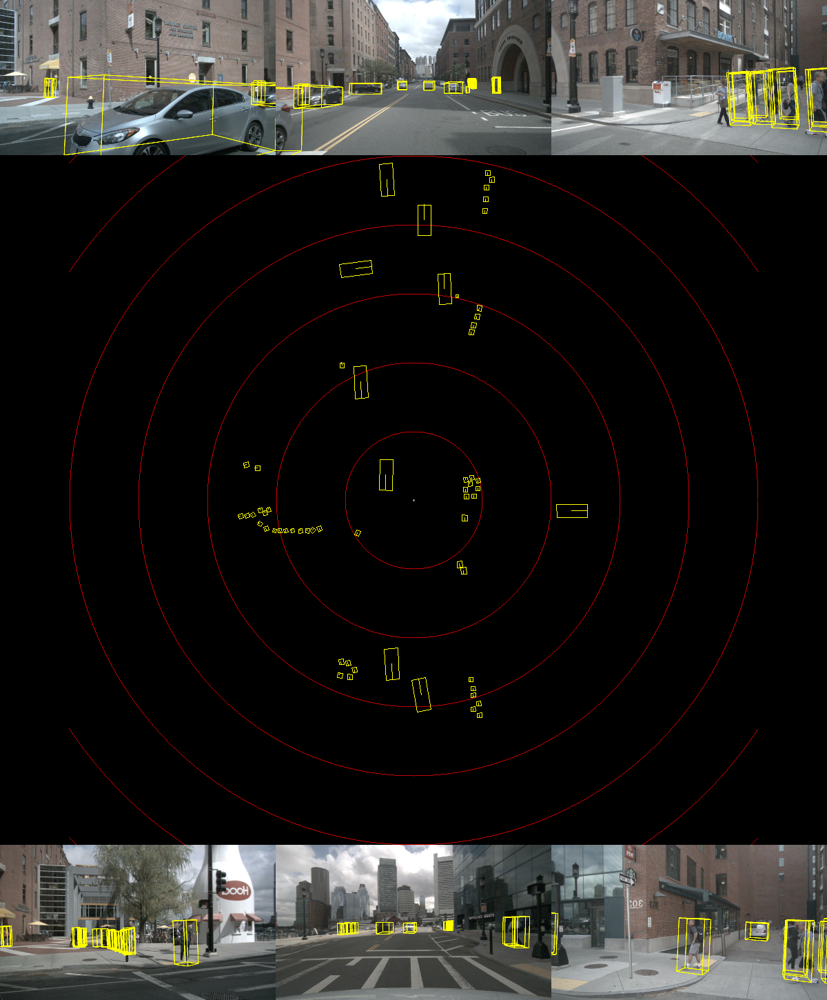
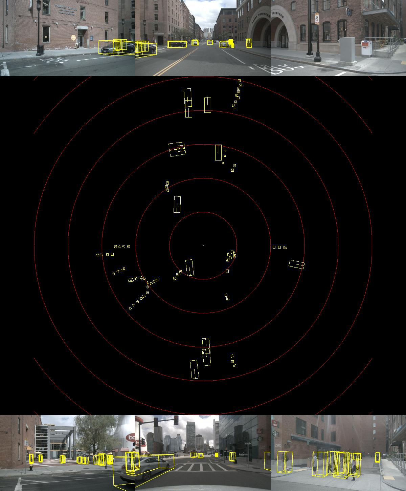

# CUDA-FastBEV

This repository contains sources and model for [Fast-BEV](https://github.com/Sense-GVT/Fast-BEV) inference using CUDA & TensorRT. And provide PTQ and QAT int8 quantization code.


## 3D Object Detection(on nuScenes validation set)
- For all models, I used the configs/fastbev_m0_r18_s256x704_v200x200x4_c192_d2_f1.py configuration, delete time sequence. 
  - The camera resolution is 256x704
  - Backbone is ResNet18, without DCN


|         **Model**        | **Framework** | **Precision** | **mAP** | **FPS** |
|:------------------------:|:-------------:|:-------------:|:-------:|:-------:|
| ResNet18 |    TensorRT    |   FP16   |  24.3  |   113.6(on RTX2080Ti)        |
| ResNet18-PTQ         |    TensorRT   | FP16+INT8     |  23.89  |  143.8  |
| ResNet18-head-PTQ    | TensorRT      | FP16 + INT8 |  23.83       |   144.9        |


## Model and Data
- For quick practice, I provide an example data of nuScenes. It contains the following:
  1. Camera images in 6 directions.
  2. Transformation matrix of camera/lidar and vtrans need data.

- All models (model.zip) can be downloaded later.It contains the following:
  1. fastbev onnx models and pytorch models.
  2. resnet18 int8 onnx and PTQ models.

## Prerequisites
To build fastbev, we need to depend on the following libraries:
- CUDA >= 11.0
- CUDNN >= 8.2
- TensorRT >= 8.5.0
- libprotobuf-dev == 3.6.1
- [Compute Capability](https://developer.nvidia.com/cuda-gpus#compute) >= sm_80
- Python >= 3.6

The data in the performance table was obtained by us on the Nvidia Orin platform, using TensorRT-8.6, cuda-11.4 and cudnn8.6 statistics.

## Quick Start for Inference

### 1. Download models and datas to CUDA-FastBEV directory
- download model.zip 
- download nuScenes-example-data.zip 
```bash
# download models and datas to CUDA-FastBEV
cd CUDA-FastBEV

# unzip models and datas
unzip model.zip
unzip nuScenes-example-data.zip

# here is the directory structure after unzipping
CUDA-FastBEV
|-- example-data
    |-- 0-FRONT.jpg
    |-- 1-FRONT_RIGHT.jpg
    |-- ...
    |-- example-data.pth
    |-- x.tensor
    |-- y.tensor
    `-- valid_c_idx.tensor
|-- src
|-- ptq
|-- model
    |-- resnet18int8
    |   |-- fastbev_pre_trt.onnx
    |   |-- fastbev_post_trt_decode.onnx
    |   |-- fastbev_ptq.pth
    |-- resnet18
    `-- resnet18int8head
`-- tool
```
### 2. Configure the environment.sh
- Install python dependency libraries
```bash
apt install libprotobuf-dev
pip install onnx
```

- Modify the TensorRT/CUDA/CUDNN/fastbev variable values in the tool/environment.sh file.
```bash
# change the path to the directory you are currently using
export TensorRT_Lib=/path/to/TensorRT/lib
export TensorRT_Inc=/path/to/TensorRT/include
export TensorRT_Bin=/path/to/TensorRT/bin

export CUDA_Lib=/path/to/cuda/lib64
export CUDA_Inc=/path/to/cuda/include
export CUDA_Bin=/path/to/cuda/bin
export CUDA_HOME=/path/to/cuda

export CUDNN_Lib=/path/to/cudnn/lib

# resnet50/resnet50int8/swint
export DEBUG_MODEL=resnet18int8

# fp16/int8
export DEBUG_PRECISION=int8
export DEBUG_DATA=example-data
export USE_Python=OFF
```

- Apply the environment to the current terminal.
```bash
. tool/environment.sh
```

### 3. Compile and run

1. Building the models for tensorRT
```bash
bash tool/build_trt_engine.sh
```

2. Compile and run the program
```bash
bash tool/run.sh
```

## PTQ and export ONNX
- PTQ
```bash
python ptq_bev.py
```
- QAT
```bash
python qat_bev.py
```
- export ONNX
```bash
python export_onnx.py
```
## DEMO show



## References
- [https://github.com/Sense-GVT/Fast-BEV]
- [https://github.com/NVIDIA-AI-IOT/Lidar_AI_Solution]
